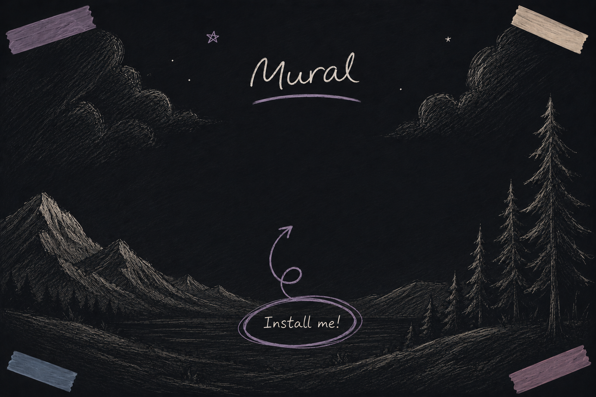
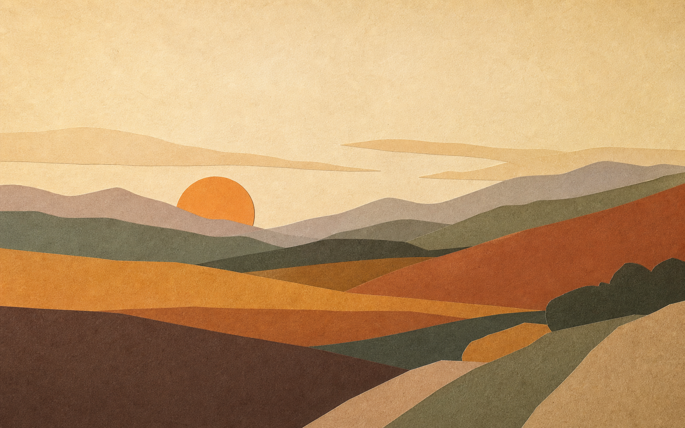

<p align="center">
  
</p>

<h1 align="center">Mural</h1>

<p align="center">
  <strong>A free, native home for the backgrounds you actually want to live with.</strong><br />
  Still art. Moving scenes. Your Mac, made personal.
</p>

<p align="center">
  <a href="#make-your-desktop-a-mural">What it does</a> ·
  <a href="#run-it">Run it</a> ·
  <a href="#the-small-print">The small print</a>
</p>

---

## Your desktop has been standing still for too long.

There are plenty of places to *find* a wallpaper. But a free, native macOS app that lets you collect your own art, use beautiful stills, and set animated video backgrounds? That space is surprisingly empty.

**Mural fills it.** It is a personal wallpaper library for macOS—quiet, tactile, and made for keeping the images and moving scenes that make a screen feel like yours.

<p align="center">
  
  <br />
  <em>Paper Sun — one of Mural’s original starter wallpapers.</em>
</p>

## Make your desktop a Mural

| | |
|:--|:--|
| **Keep a real library** | Import local images and videos, keep favourites close, and revisit recently used wallpapers. |
| **Set the scene** | Apply a wallpaper to every display or only your main display. |
| **Let it move** | On supported macOS releases, use videos as native animated wallpapers on the Desktop and Lock Screen—even after Mural is closed. |
| **Start somewhere lovely** | Mural includes Paper Sun and five procedural wallpapers, rendered locally at 2880×1800 when you choose them. |

## Made to feel like a little gallery

Mural is built with SwiftUI for macOS. No web wrapper, no account, no wallpaper storefront—just a small library that gives your desktop the attention it deserves.

> Bring your own collection, make a few favourites, and let the background be more than an afterthought.

## Run it

Mural’s static wallpaper library requires **macOS 14 or later**.

```sh
swift run Mural
```

### Build the complete app

```sh
./scripts/build-app.sh
open dist/Mural.app
```

The build script creates an ad-hoc signed `dist/Mural.app` containing the Mural wallpaper extension.

## Animated wallpapers

Native video wallpaper support requires **macOS 26 and Xcode 26**. Mural uses Apple’s private `WallpaperExtensionKit` integration: `WallpaperAgent` keeps playback running on the Desktop and Lock Screen after the app closes, across displays and Spaces.

If macOS cannot apply the video automatically, Mural opens the **Mural — Video Wallpapers** collection in System Settings so you can select it there. When a video is removed from Mural, its deployed system copy is retained while macOS still uses it—so an active wallpaper never loses its media.

## The small print

The video-wallpaper integration depends on private Apple frameworks. It may break after a macOS update and is not suitable for Mac App Store distribution. For bundled artwork and font notices, see [Third-party notices](THIRD_PARTY_NOTICES.md).
