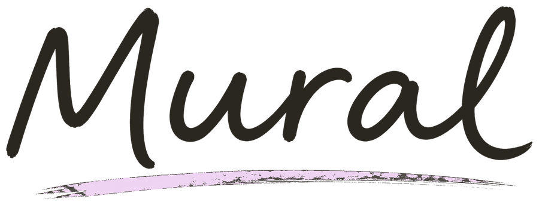
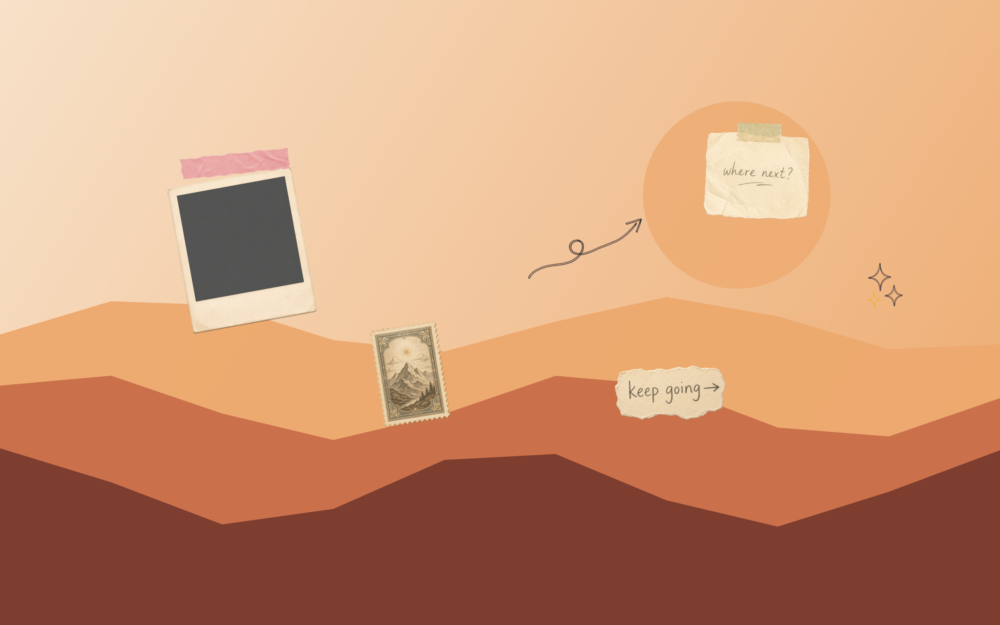
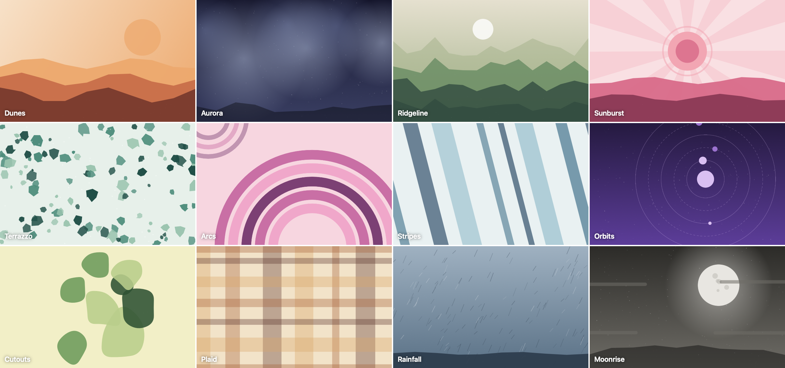
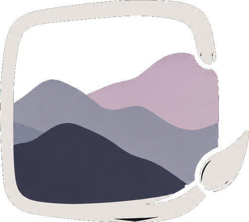

<br />

<p align="center">
  <picture>
    <source media="(prefers-color-scheme: dark)" srcset="Sources/Mural/Resources/WordmarkDark.png">
    <source media="(prefers-color-scheme: light)" srcset="Sources/Mural/Resources/WordmarkLight.png">
    
  </picture>
</p>

<p align="center">
  <strong>A free, native home for the backgrounds you actually want to live with.</strong>
  <br />
  Still art. Moving scenes. Your Mac, made personal.
</p>

<p align="center">
  
  
  
  
</p>

<p align="center">
  <a href="#the-gallery">The gallery</a>
  &nbsp;·&nbsp;
  <a href="#mural-studio">Mural Studio</a>
  &nbsp;·&nbsp;
  <a href="#run-it">Run it</a>
  &nbsp;·&nbsp;
  <a href="#animated-wallpapers">Animated wallpapers</a>
  &nbsp;·&nbsp;
  <a href="#the-small-print">The small print</a>
</p>

<br />

---

## Why Mural exists

There is no good home for wallpapers on a Mac. System Settings buries them, and most wallpaper apps are paid, web-wrapped, or full of stock art you will never use.

Mural is a small native app with one job: keep the wallpapers you actually like, still or moving, and put them on your screen.

<p align="center">
  
  <br />
  <sub><em>Make It Happen, one of Mural's bundled wallpapers.</em></sub>
</p>

## The gallery

Mural ships with a hand-picked starter collection of eighteen stills spanning woodblock prints, anime skylines, neon nights, and quiet mornings, plus five procedural wallpapers rendered locally at 2880×1800 the moment you choose them.

<table>
  <tr>
    <td width="33%" align="center">
      <br />
      <sub><em>Chureito Bloom</em></sub>
    </td>
    <td width="33%" align="center">
      <br />
      <sub><em>Northern Lights Observatory</em></sub>
    </td>
    <td width="33%" align="center">
      <br />
      <sub><em>Shinjuku Rain</em></sub>
    </td>
  </tr>
  <tr>
    <td width="33%" align="center">
      <br />
      <sub><em>Lake Ashi Woodblock</em></sub>
    </td>
    <td width="33%" align="center">
      <br />
      <sub><em>Zen Garden Dawn</em></sub>
    </td>
    <td width="33%" align="center">
      <br />
      <sub><em>Pacific Coast Highway</em></sub>
    </td>
  </tr>
  <tr>
    <td width="33%" align="center">
      <br />
      <sub><em>Highland Fog</em></sub>
    </td>
    <td width="33%" align="center">
      <br />
      <sub><em>Amalfi Reverie</em></sub>
    </td>
    <td width="33%" align="center">
      <br />
      <sub><em>Bled Morning</em></sub>
    </td>
  </tr>
</table>

<p align="center"><sub><em>…and nine more waiting in the box.</em></sub></p>

## Mural Studio

When nothing in the box fits, sketch your own. Mural Studio is a small wallpaper workshop built into the sidebar: pick one of twelve drawn backdrop styles: dunes, aurora, plaid, moonrise, and friends, or start from a photo of your own, then tune it with seventeen curated palettes, free-form colors, and a variation dice until it feels right.

Then comes the fun part: scrapbook stickers. Taped paper notes, washi tape, a polaroid frame, a vintage postage stamp, and hand-drawn doodles — drag them anywhere, resize, rotate, layer. Everything renders locally at 2880×1800 and lands in My Wallpapers, one click away from your desktop.

<p align="center">
  
  <br />
  <sub><em>A Dunes backdrop, decorated in the studio.</em></sub>
</p>

<p align="center">
  
  <br />
  <sub><em>Photos make backdrops too — start from a picture like Amalfi Reverie and decorate from there.</em></sub>
</p>

<p align="center">
  
  <br />
  <sub><em>All twelve backdrop styles, each wearing a different palette.</em></sub>
</p>

## Made to feel like a little gallery

Mural is built with SwiftUI for macOS. No web wrapper, no account, no wallpaper storefront. Just a small library that gives your desktop the attention it deserves. Import local images and videos, keep favourites close, revisit recently used wallpapers, and apply them to every display or only your main one.

> Bring your own collection, make a few favourites, and let the background be more than an afterthought.

## Run it

Mural's static wallpaper library requires **macOS 14 or later**.

```sh
swift run Mural
```

### Build the complete app

```sh
./scripts/build-app.sh
open dist/Mural.app
```

The build script creates an ad-hoc signed `dist/Mural.app` containing the Mural wallpaper extension. To package it as an installer, run `./scripts/build-dmg.sh`, which produces `dist/Mural.dmg`.

## Animated wallpapers

Native video wallpaper support requires **macOS 26 and Xcode 26**. Mural uses Apple's private `WallpaperExtensionKit` integration: `WallpaperAgent` keeps playback running on the Desktop and Lock Screen after the app closes, across displays and Spaces.

If macOS cannot apply the video automatically, Mural opens the **Mural — Video Wallpapers** collection in System Settings so you can select it there. When a video is removed from Mural, its deployed system copy is retained while macOS still uses it, so an active wallpaper never loses its media.

## The small print

The video-wallpaper integration depends on private Apple frameworks. It may break after a macOS update and is not suitable for Mac App Store distribution. For bundled artwork and font notices, see [Third-party notices](THIRD_PARTY_NOTICES.md).

<br />

<p align="center">
  
  <br />
  <sub><em>Made for Macs that deserve better backgrounds.</em></sub>
</p>
